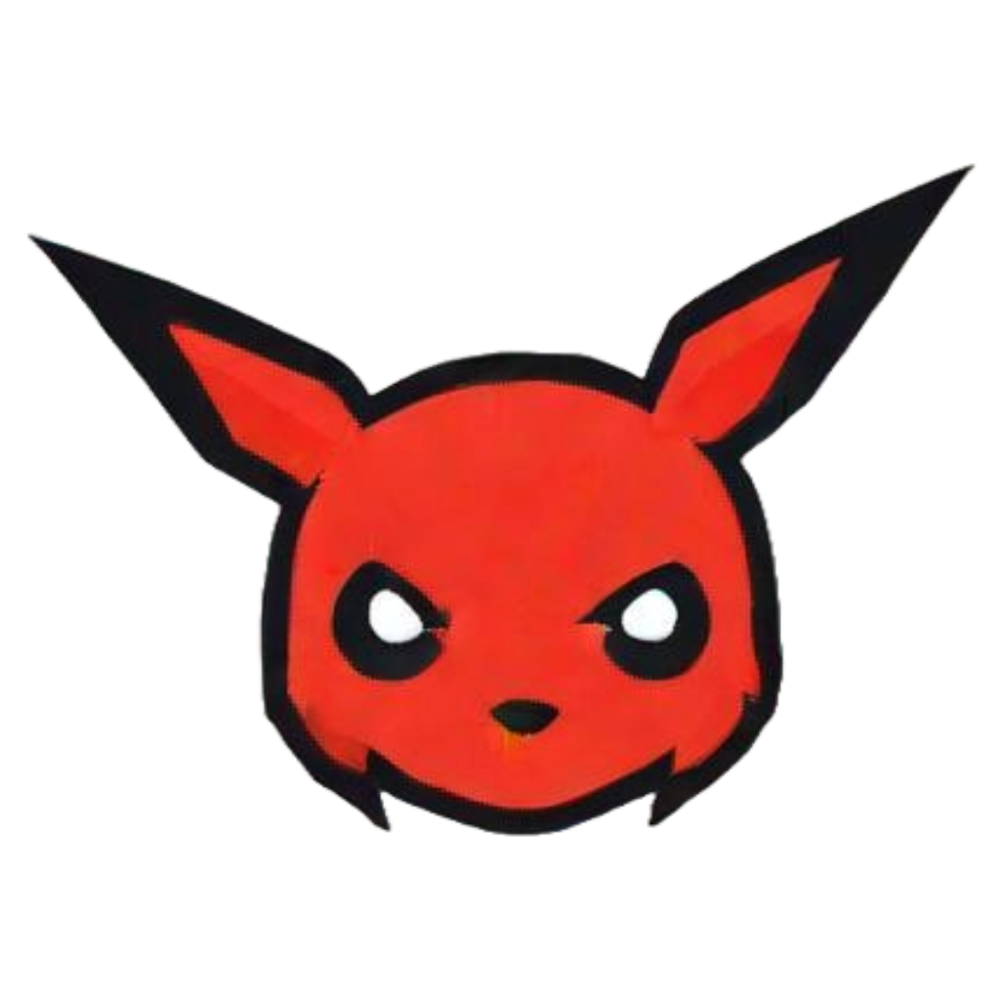
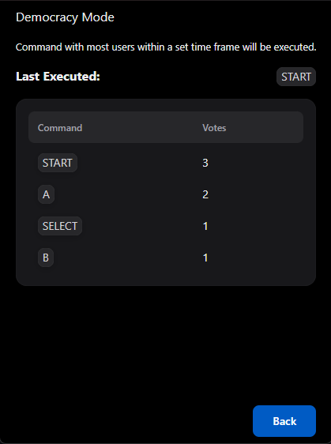
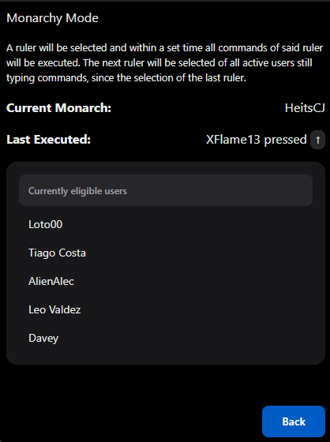
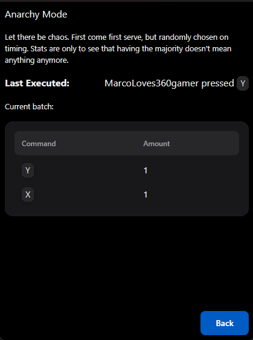
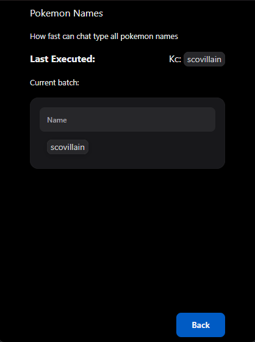
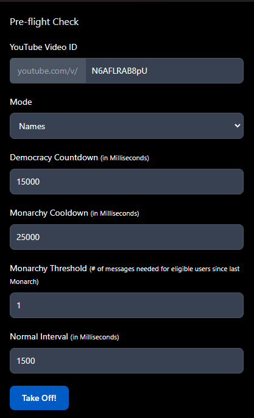

<div align="center">

</div>
<h1>YouTube Plays, inspired by Astroid Videos' latest streams</h1>
<p>Uses the LiveChat of YouTube to send keyboard keys or strings (text) to the currently active window.<br>Specifically made for Pokemon and I plan to basically revolve the features around PokeTubers, after all, I made this originally for Frank.</p>

<h4 align="center"> <span> · </span> <a href="https://github.com/Agash/YTPlays/blob/master/README.md"> Documentation </a> <span> · </span> <a href="https://github.com/Agash/YTPlays/issues"> Report Bug </a> <span> · </span> <a href="https://github.com/Agash/YTPlays/issues"> Request Feature </a> </h4>

# :notebook_with_decorative_cover: Table of Contents

- [About the Project](#star2-about-the-project)
- [Todos](#compass-roadmap)
- [Contact](#handshake-contact)
- [Acknowledgements](#gem-acknowledgements)

## :star2: About the Project

So Frank ([Astroid Videos on YouTube](https://www.youtube.com/@AstroidmaniaVideos)) had some fun ideas for streams with chat. I thought I'd implement those. He actually got a couple of people helping him out, so I took the time to fix up a GUI (still messy code tho). It can do TwitchPlays style chat control with 3 modes (democracy, monarchy, anarchy) and also let chat type pokemon names, another great stream from Frank (also coding detours are always fun to watch).

### :camera: Screenshots

<div align="center">
     &nbsp;
     &nbsp;
     &nbsp;
     &nbsp;
    
</div>

### :space_invader: Tech Stack

<li><a href="https://react.dev/">react</a></li>

<li><a href="https://www.electronjs.org/">electron</a></li>

## :toolbox: Getting Started

### :gear: Installation

Download the latest setup file and double click on it. It'll install and update automatically, it'll create a shortcut called ytplays.

```
ytplays-X.X.X.Setup.exe
```

## :compass: Todos

- [x] basic functionality
- [x] basic GUI
- [ ] write tests
- [ ] button remapping
- [ ] controller simulation
- [ ] possibly rewrite everything afterwards using maybe C# after shaking down the concept..

## :handshake: Contact

Agash - [Twitter](https://twitter.com/a_thmo_)

Project Link: [https://github.com/Agash/YTPlays](https://github.com/Agash/YTPlays)

## :gem: Acknowledgements

This project wouldn't be possible without the amazing YouTube.js library, since YouTube's API is useless for these use cases.

- [YouTube.js by LuanRT](https://github.com/LuanRT/YouTube.js)

Inspired by:

- [YoutubePlays by XLuma](https://github.com/XLuma/YoutubePlays/)
